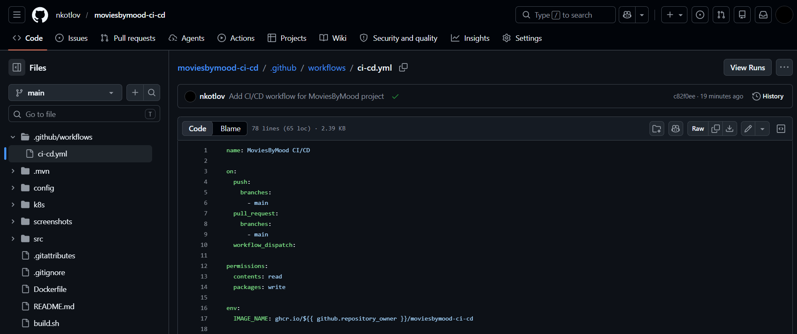
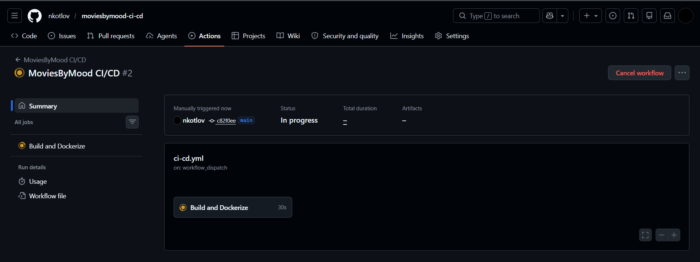
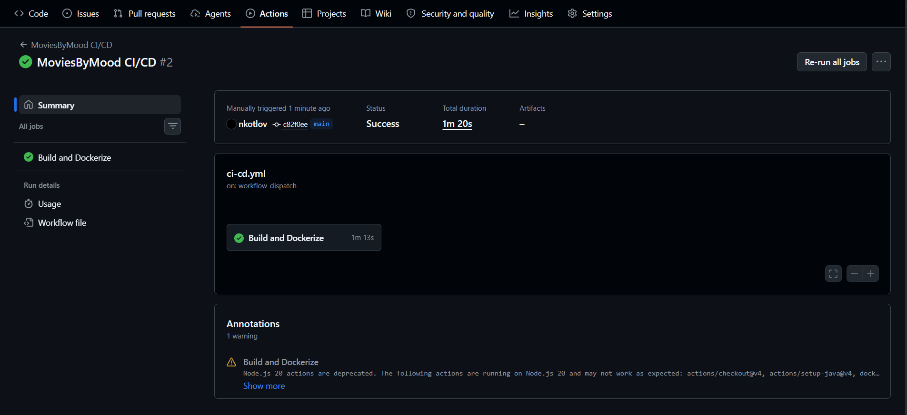
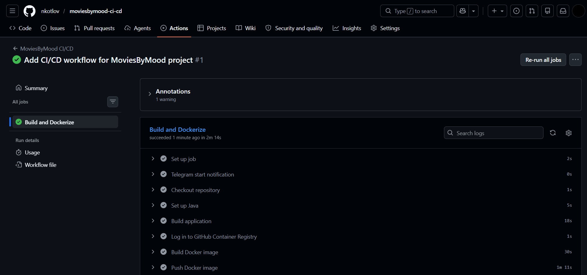
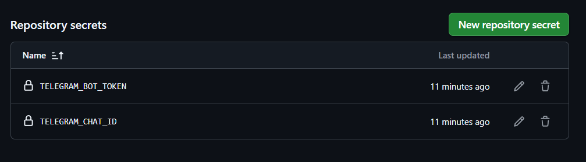
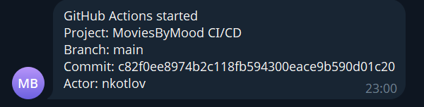
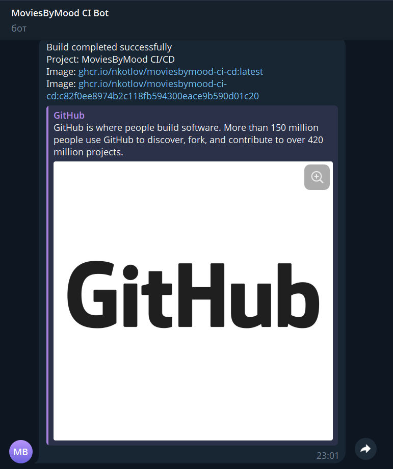
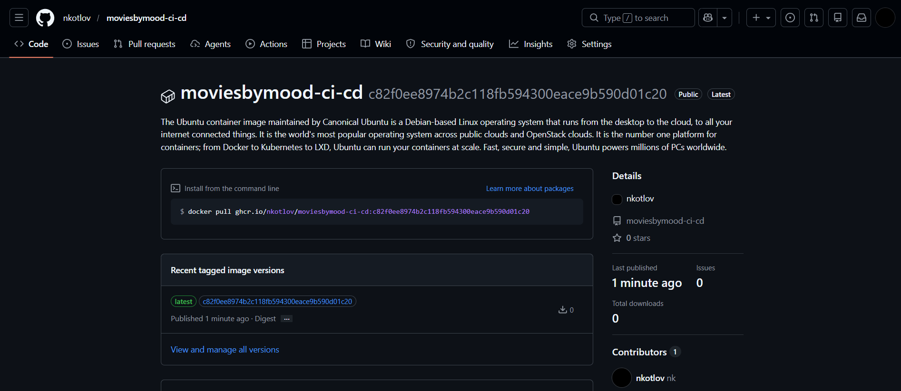

# Практическая работа по DevOps

Студент: Котлов Никита
Группа: 11-306
Проект: MoviesByMood CI/CD

## Задание

Необходимо изучить GitHub Actions и с его помощью автоматизировать сборку собственного приложения и упаковку приложения в Docker-контейнер.

Также необходимо добавить Telegram-бота для отправки уведомлений о запуске workflow и результате сборки.

В работе реализовано:

```text
автоматическая сборка Java-приложения
сборка Docker-образа
публикация Docker-образа в GitHub Container Registry
ручной запуск workflow
автоматический запуск workflow при push и pull request
Telegram-уведомления о запуске и результате сборки
```

## Ссылка на проект

```text
https://github.com/nkotlov/moviesbymood-ci-cd
```

## Ссылка на Docker-образ

```text
ghcr.io/nkotlov/moviesbymood-ci-cd:latest
```

Пример загрузки образа:

```bash
docker pull ghcr.io/nkotlov/moviesbymood-ci-cd:latest
```

## Описание приложения

MoviesByMood — веб-приложение для подбора фильмов по настроению.

Пользователь может просматривать фильмы, жанры, актеров, режиссеров, категории настроений, а также работать с профилем, рейтингами, комментариями и плейлистами.

Приложение использует базу данных PostgreSQL для хранения данных.

## Используемый стек

```text
Java 20
Spring Boot
Maven
Spring Security
Spring Data JPA
Thymeleaf
PostgreSQL
Docker
Docker Compose
GitHub Actions
GitHub Container Registry
Telegram Bot API
```

## Структура CI/CD

Файл автоматизации расположен по пути:

```text
.github/workflows/ci-cd.yml
```

Скриншот файла workflow:



## Условия запуска workflow

Workflow запускается в следующих случаях:

```text
push в ветку main
pull request в ветку main
ручной запуск через workflow_dispatch
```

Ручной запуск выполняется через вкладку `Actions` в GitHub.

Скриншот ручного запуска workflow:



## Общий принцип автоматической сборки

После запуска GitHub Actions выполняет следующие шаги:

```text
1. Отправляет уведомление в Telegram о запуске workflow
2. Загружает исходный код из репозитория
3. Устанавливает Java
4. Собирает приложение через Maven
5. Собирает Docker-образ приложения
6. Выполняет вход в GitHub Container Registry
7. Публикует Docker-образ в GHCR
8. Отправляет уведомление в Telegram о результате сборки
```

Скриншот успешного выполнения workflow:



Скриншот шагов workflow:



## Листинг автоматизации

```yaml
name: MoviesByMood CI/CD

on:
  push:
    branches:
      - main
  pull_request:
    branches:
      - main
  workflow_dispatch:

permissions:
  contents: read
  packages: write

env:
  IMAGE_NAME: ghcr.io/${{ github.repository_owner }}/moviesbymood-ci-cd

jobs:
  build-test-docker:
    name: Build and Dockerize
    runs-on: ubuntu-latest

    steps:
      - name: Telegram start notification
        if: always()
        run: |
          curl -s -X POST "https://api.telegram.org/bot${{ secrets.TELEGRAM_BOT_TOKEN }}/sendMessage" \
          -d chat_id="${{ secrets.TELEGRAM_CHAT_ID }}" \
          -d text="GitHub Actions started%0AProject: MoviesByMood CI/CD%0ABranch: ${{ github.ref_name }}%0ACommit: ${{ github.sha }}%0AActor: ${{ github.actor }}"

      - name: Checkout repository
        uses: actions/checkout@v4

      - name: Set up Java
        uses: actions/setup-java@v4
        with:
          distribution: temurin
          java-version: '20'
          cache: maven

      - name: Build application
        run: mvn clean package -DskipTests

      - name: Log in to GitHub Container Registry
        if: github.event_name != 'pull_request'
        uses: docker/login-action@v3
        with:
          registry: ghcr.io
          username: ${{ github.actor }}
          password: ${{ secrets.GITHUB_TOKEN }}

      - name: Build Docker image
        run: |
          docker build \
            -t $IMAGE_NAME:latest \
            -t $IMAGE_NAME:${{ github.sha }} \
            .

      - name: Push Docker image
        if: github.event_name != 'pull_request'
        run: |
          docker push $IMAGE_NAME:latest
          docker push $IMAGE_NAME:${{ github.sha }}

      - name: Telegram success notification
        if: success()
        run: |
          curl -s -X POST "https://api.telegram.org/bot${{ secrets.TELEGRAM_BOT_TOKEN }}/sendMessage" \
          -d chat_id="${{ secrets.TELEGRAM_CHAT_ID }}" \
          -d text="Build completed successfully%0AProject: MoviesByMood CI/CD%0AImage: $IMAGE_NAME:latest%0AImage: $IMAGE_NAME:${{ github.sha }}"

      - name: Telegram failure notification
        if: failure()
        run: |
          curl -s -X POST "https://api.telegram.org/bot${{ secrets.TELEGRAM_BOT_TOKEN }}/sendMessage" \
          -d chat_id="${{ secrets.TELEGRAM_CHAT_ID }}" \
          -d text="Build failed%0AProject: MoviesByMood CI/CD%0ABranch: ${{ github.ref_name }}%0ACommit: ${{ github.sha }}"
```

## Telegram-уведомления

Для уведомлений используется Telegram Bot API.

В GitHub Secrets добавлены переменные:

```text
TELEGRAM_BOT_TOKEN
TELEGRAM_CHAT_ID
```

Секреты не хранятся в коде проекта и используются только внутри GitHub Actions.

Скриншот добавленных секретов:



Скриншот уведомления о запуске workflow:



Скриншот уведомления об успешном завершении сборки:



## Результаты сборки

Результатом работы pipeline является Docker-образ приложения.

Образ публикуется в GitHub Container Registry:

```text
ghcr.io/nkotlov/moviesbymood-ci-cd:latest
```

Также создается тег с хешем коммита:

```text
ghcr.io/nkotlov/moviesbymood-ci-cd:<commit-sha>
```

Скриншот опубликованного Docker-образа:



## Ручная сборка Docker-образа

Docker-образ можно собрать вручную командой:

```bash
docker build -t moviesbymood-ci-cd .
```

## Запуск через Docker Compose

Для локального запуска приложения используется Docker Compose:

```bash
docker compose up --build
```

После запуска приложение доступно по адресу:

```text
http://localhost:8081
```

## Где хранятся результаты сборки

Результаты сборки хранятся в GitHub Container Registry.

Основной опубликованный образ:

```text
ghcr.io/nkotlov/moviesbymood-ci-cd:latest
```

Версия конкретного коммита:

```text
ghcr.io/nkotlov/moviesbymood-ci-cd:<commit-sha>
```

## Вывод

В ходе работы был изучен GitHub Actions и настроен CI/CD pipeline для Java Spring Boot приложения MoviesByMood.

Pipeline автоматически собирает приложение, создает Docker-образ, публикует его в GitHub Container Registry и отправляет уведомления в Telegram о запуске и результате сборки.
